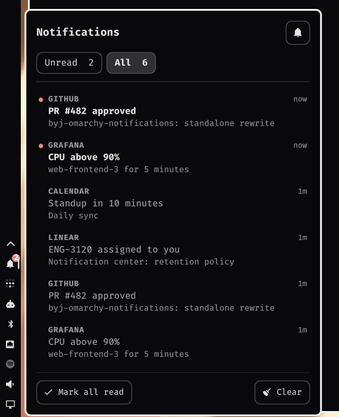

# Notification Center

An [Omarchy 4](https://omarchy.org) shell plugin: a bell in the bar carrying an
unread badge, opening a flyout that lists your notifications under two tabs —
**Unread** and **All**.



## Why

Omarchy's built-in notification service shows toasts and keeps the last ten of
them for `showHistory` to replay. That is all it is meant to do. This plugin
adds the two things a notification centre needs on top of it:

- **a read flag per notification**, so the bell can carry a count of what you
  have not looked at yet
- **a deeper backlog** — 500 notifications instead of ten

It does **not** replace the notification daemon. `omarchy.notifications` keeps
the D-Bus name, the toasts and do-not-disturb; this plugin attaches to it
in-process and keeps its own store alongside. So it installs with one command,
coexists with everything, and does not need re-syncing every Omarchy release.

## Install

```bash
omarchy plugin add https://github.com/BitYoungjae/byj-omarchy-notifications.git --enable
```

Pick a bar section when prompted, or place it afterwards:

```bash
omarchy bar move byj.notification-center --section right
```

To update or remove:

```bash
omarchy plugin update byj.notification-center
omarchy plugin remove byj.notification-center
```

## Use

| Action | Result |
|---|---|
| Left click the bell | Open / close the flyout |
| Right click the bell | Toggle do-not-disturb |
| Left click a row | Run the notification's action, or focus the app that sent it; marks it read and closes |
| Right click a row | Mark read without leaving the list |
| `Mark all read` | Clear the badge, keep the list |
| `Clear` | Empty the centre (Omarchy's own history is left alone) |
| `←` / `→` | Switch tabs while the flyout has focus |

The bell shows an outline when everything is read, fills in when something is
not, and becomes a struck-through bell under do-not-disturb. The badge stays
visible while silenced — "what did I miss" is exactly what it is for.

### IPC

```bash
omarchy-shell notification-center toggle        # open / close the flyout
omarchy-shell notification-center unread        # the current unread count
omarchy-shell notification-center markAllRead
omarchy-shell notification-center clear
```

Handy for a keybinding:

```lua
-- ~/.config/hypr/bindings.lua
o.bind("SUPER, N", "exec", "omarchy-shell notification-center toggle")
```

## How it works

Notifications are picked up from the first-party service's live popup model, in
process — no polling, no file watching, and no second daemon on the bus. Each
one is snapshotted into `~/.local/state/byj-notification-center/store.json`
with a read flag, newest 500 kept.

Do-not-disturb is the one case that never reaches that model: a silenced
notification is written straight into Omarchy's history directory and never
shown. So while do-not-disturb is on — and only then — the plugin also sweeps
that directory every five seconds. Omarchy keeps ten entries there, so nothing
is missed unless more than ten arrive between ticks.

## Requirements

Omarchy 4 (tested on 4.0.1). No other dependencies.

## Licence

MIT — see [LICENSE](LICENSE).

Omarchy itself is MIT-licensed by Basecamp. This plugin ships no Omarchy code;
it calls the shell's public plugin API (`qs.Ui`, `qs.Commons`,
`shell.serviceFor`) and reads the state layout the notification service
already writes.
